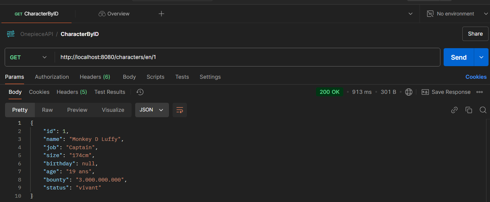

## 🏴‍☠️ OnePiece API Client 🚢

Este proyecto te permite acceder a los datos de los personajes de la tripulación de *One Piece* a través de la OnePiece API, utilizando **OpenFeign** para realizar las solicitudes HTTP de manera sencilla. Con este proyecto, puedes obtener información como el nombre y el ID de los personajes de la serie. 🌊✨

📚 **Enlace a la API**

La API utilizada en este proyecto es la **OnePiece API**. Puedes consultar la documentación oficial de la API aquí:  
🔗 [OnePiece API Documentation](https://api-onepiece.com/en/documentation)

## ⚙️ Atributos del Personaje

Cuando consultas un personaje por **ID**, la API devuelve los siguientes atributos:

- **name**: Nombre del personaje.
- **job**: El trabajo o rol del personaje (ej. pirata, marine, etc.).
- **size**: El tamaño del personaje.
- **birthday**: La fecha de nacimiento del personaje.
- **age**: La edad del personaje.
- **bounty**: La recompensa o bonificación que ofrece el gobierno por la captura del personaje.
- **status**: El estado actual del personaje (por ejemplo, vivo, muerto, etc.).

## 📸 Consulta Realizada en Postman

Aquí tienes una captura de pantalla que muestra cómo se realiza la consulta en **Postman** para obtener los datos de un personaje a través de su ID.

